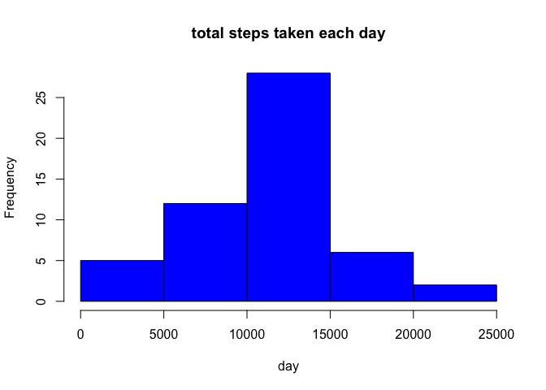
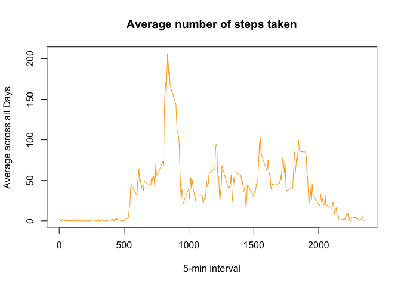
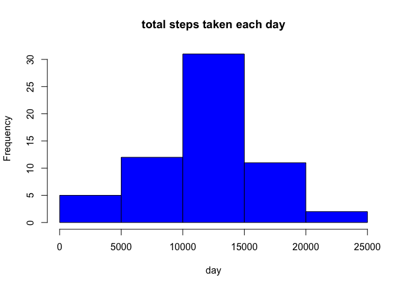
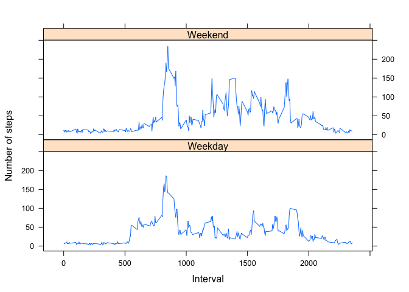

# Reproducible Research: Peer Assessment 1


## Loading and preprocessing the data

--------------------------------------------
load the Data
format the date column, 
other columns 'steps' and 'interval' are not necessary since they are already formatted as integer
--------------------------------------------


```r
pdata <- read.csv("activity.csv")
pdata$date <- as.Date(pdata$date, "%Y-%m-%d")
```

------------------------
use aggregate function
To get number of steps per day
-----------------------

```r
StepsPerDay <- aggregate(steps ~ date, data = pdata, sum, na.rm = TRUE)
```

## What is mean total number of steps taken per day?

-----------------------
a histogram of the total number of steps taken each day
and the mean and median total number of steps taken per day
-----------------------

```r
hist(StepsPerDay$steps, main = "total steps taken each day", xlab = "day", col = "blue")
```

 

```r
pmean <- mean(StepsPerDay$steps)
pmedian <- median(StepsPerDay$steps)
```

## What is the average daily activity pattern?

-------
Make a time series plot (i.e. type = "l") of the 5-minute interval (x-axis) and the average number of steps taken, averaged across all days (y-axis)

get mean of steps per interval
-------

```r
time_series <- tapply(pdata$steps, pdata$interval, mean, na.rm = TRUE)

plot(row.names(time_series), time_series, type = "l", xlab = "5-min interval", 
    ylab = "Average across all Days", main = "Average number of steps taken", col = "orange")
```

 

-----
show which 5-minute interval, on average across all the days in the dataset, contains the maximum number of steps?
-----

```r
max_interval <- which.max(time_series)
names(max_interval)
```

```
## [1] "835"
```

## Imputing missing values

-----
Calculate and report the total number of missing values in the dataset (i.e. the total number of rows with NAs)
-----

```r
missingValues <- sum(is.na(pdata))
missingValues
```

```
## [1] 2304
```

-----
a create new dataset that is equal to the original dataset
-----

```r
pdata_new <- pdata  
```

-----
replace all the missing values 'na' with the random values
-----

```r
for (i in 1:nrow(pdata_new)){
if (is.na(pdata_new[i,]$steps)){
pdata_new[i,]$steps <- sample(1:max_interval, 1)
}}
```
------------------------
use aggregate function
To get number of steps per day of the new dataset
-----------------------

```r
StepsPerDay_new <- aggregate(steps ~ date, data = pdata_new, sum, na.rm = TRUE)
```

------
histogram of the total number of steps taken each day and 
Calculate and report the mean and median total number of steps taken per day
------

```r
hist(StepsPerDay_new$steps, main = "total steps taken each day", xlab = "day", col = "blue")
```

 

```r
pmean_new <- mean(StepsPerDay_new$steps)
pmedian_new <- median(StepsPerDay_new$steps)
```
-----
after replacing all 'Nas' with random values the histogram differes abit (its random every tme different)
-----
## Are there differences in activity patterns between weekdays and weekends?

------
Create a new factor variable in the dataset with two levels -- "weekday" and "weekend" indicating whether a given date is a weekday or weekend day.
------

```r
day <- weekdays(pdata_new$date)
daylevel <- vector()
for (i in 1:nrow(pdata_new)) {
    if (day[i] == "Friday" | day[i] == "Saturday") {
        daylevel[i] <- "Weekend"
    } else {
        daylevel[i] <- "Weekday"
    }
}
```
-----
Make a panel plot containing a time series plot (i.e. type = "l") of the 5-minute interval (x-axis) and the average number of steps taken, averaged across all weekday days or weekend days (y-axis). The plot should look something like the following, which was created using simulated data:
-----

```r
pdata_new$daylevel <- daylevel
pdata_new$daylevel <- factor(pdata_new$daylevel)

stepsByDay <- aggregate(steps ~ interval + daylevel, data = pdata_new, mean)
names(stepsByDay) <- c("interval", "daylevel", "steps")

library(lattice)

xyplot(steps ~ interval | daylevel, stepsByDay, type = "l", layout = c(1, 2), 
    xlab = "Interval", ylab = "Number of steps")
```

 


